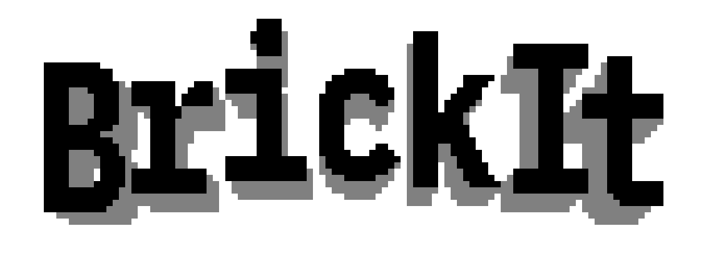
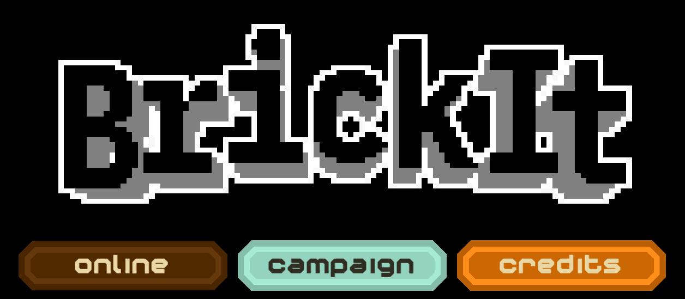
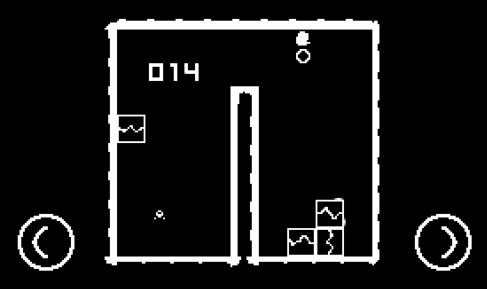
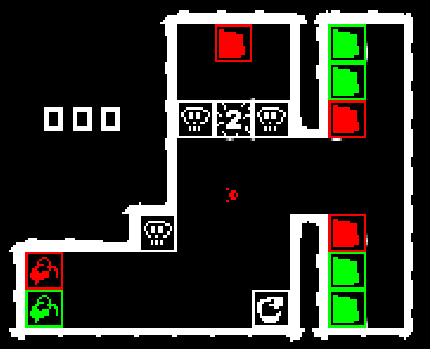

    

This little open source puzzle game was inspired by the game HitBlock.
It started as a side project between Maico and Janek.
Currently development progresses slow due to low motivation.

## Screenshots

## Contributing

Pull requests are welcome. For major changes, please open an issue first to discuss what you would like to change.

There are no tests planed.

## License

Not decided yet. Maybe [MIT](https://choosealicense.com/licenses/mit/) in the future.
